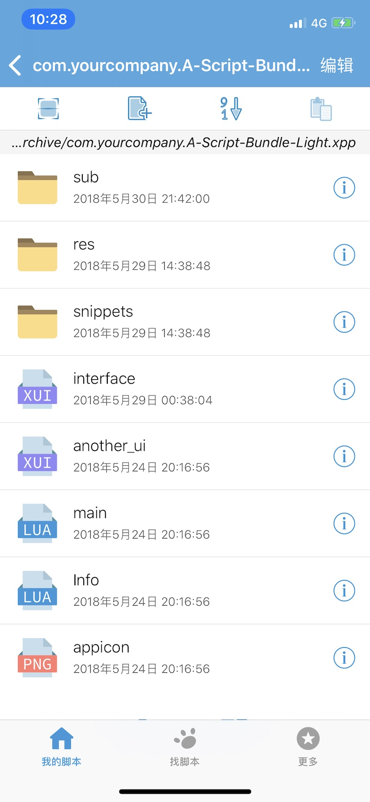

## XPP 格式

**XPP** \( 以下称作“脚本应用包” \) 是可以被 XXTouch 解析、查看与执行的一种 Bundle \( 包 \) 结构，以单一文件的形式出现在用户面前。这个“文件”实际上是一个以 **\.xpp** 为扩展名的目录 \( 文件夹 \) ，其目录结构如下：

|  文件  |  描述  |
|--------|--------|
|`Info.lua`|信息文件结构化存储了脚本应用包的配置。XXTouch 依赖此文件辨识 XPP 及相关文件的信息。|
|可执行脚本|每个脚本应用包都必须包含至少一个可执行脚本 \( `.xxt`, `.lua` \) 。|
|界面配置|可选，脚本应用包中可以包含 XUI 配置 \( `.xui`, `.xuic` \) ，为该应用提供配置界面。|
|资源文件|可选，可执行脚本以外所需的数据文件。通常，资源文件包含了图像、图标、声音、本地化串、配置文件及其它数据。大多数资源文件是为特定的一些语言或地区准备的，亦可为通用资源。|

**什么是 Bundle \(包\)？**

Bundle \( 包 \) 是一种特定结构、特定扩展名的目录 \( 文件夹 \) ，这种结构允许将相关资源（例如可执行文件，本地化资源，图片等）组合在一起，成为在概念上独立的项目。

多数类型的 Bundle \( 包 \) 在使用时与常规文件类似，从而减少了其内部文件意外更改或丢失的风险。同时，Bundle \( 包 \) 的另一个意义在于可以使用文件夹简化组织资源的方式，避免使用资源分支导致的额外的复杂性。

