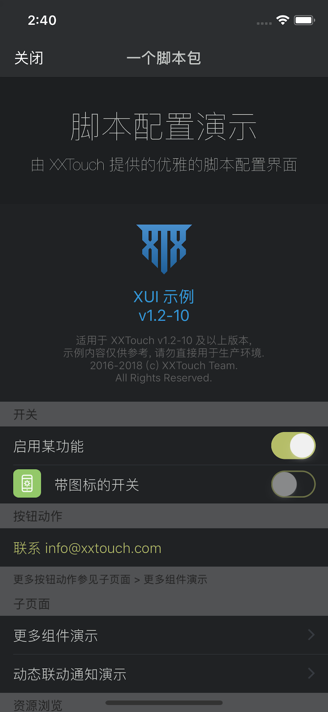

### 主题

在根层级设置 `theme` 字典, 能为界面配置统一的样式, 所有的组件以及子页面都将继承根层级主题字典的所有字段.

**如需要为组件单独设置样式, 可以在各组件字典中设置 `theme` 字典. 组件 `theme` 字典中的字段将覆盖根层级的 `theme` 字典, 从而发生主题样式的合并. 不同的组件可以有它们自身特有的主题属性, 参见每个组件的 *主题键* 表格.**

**如果组件链接到一个非 XUI 子页面, 如 `Option`/`MultipleOption`/`OrderedOption`/`EditableList` 组件, 则子页面的主题样式将使用组件的 `theme` 字典; 如果组件链接到另一个 XUI 子页面, 如 `Link` 组件, 则子页面中可以单独设置 `theme` 字典, 并与父页面的发生主题样式的合并.**

#### 界面

|键|类型|描述|
|---|---|---|
|style|风格|界面风格|
|tintColor|*颜色*|前景颜色|
|backgroundColor|*颜色*|背景颜色|
|separatorColor|*颜色*|组件分隔线颜色|
|backgroundImage|字符串|背景图片相对路径|

#### 导航栏

|键|类型|描述|
|---|---|---|
|navigationBarColor|*颜色*|导航栏背景颜色|
|navigationTitleColor|*颜色*|导航栏标题颜色|

#### 页首与页尾

|键|类型|描述|
|---|---|---|
|headerTextColor|*颜色*|`header` 文字颜色|
|subheaderTextColor|*颜色*|`subheader` 文字颜色|
|footerTextColor|*颜色*|页尾文字颜色|
|headerBackgroundColor|*颜色*|`header` 背景颜色|
|footerBackgroundColor|*颜色*|页尾背景颜色|

#### 通用组件

|键|类型|描述|
|---|---|---|
|cellBackgroundColor|*颜色*|组件背景颜色|
|disclosureIndicatorColor|*颜色*|组件指示器颜色|
|selectedColor|*颜色*|选中颜色|
|highlightedColor|*颜色*|高亮颜色|
|labelColor|*颜色*|标题文字颜色|
|valueColor|*颜色*|值文字颜色|

#### 状态

|键|类型|描述|
|---|---|---|
|dangerColor|*颜色*|错误颜色|
|warningColor|*颜色*|警告颜色|
|successColor|*颜色*|成功颜色|

#### 风格

|style|描述|
|---|---|
|Grouped|组风格 (默认)|
|Plain|平铺风格|

类型 *颜色*, 即以 `#` 开头的, 十六进制 RGB/RGBA 字符串形式, 如 `#FF0000` 代表红色. 

