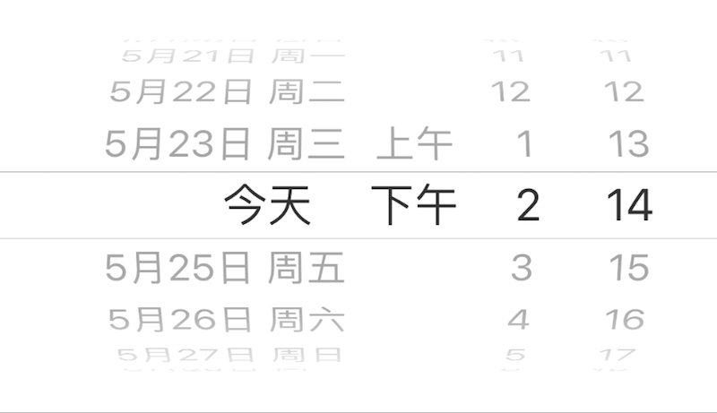

### DateTime 时间日期选择器

此组件在界面上显示一个时间日期选择器, 用于日期、时间的选择及时间间隔的调整. 

|键|类型|描述|必选|默认值|最低版本需求|
|---|---|---|---|---|---|
|min|数值|时间间隔最小值|\-|`0`|\-|
|max|数值|时间间隔最大值|\-|`FLOAT_MAX`|\-|
|minuteInterval|整数|时间间隔歩长, 单位分钟|\-|`1`|\-|
|mode|字符串|选择器模式|\-|`datetime`|\-|
|format|字符串|时间格式 (ISO8601)|\-|`nil`|\-|

此组件不支持 `label`/`icon`, 如需要设置标题和描述, 请配合 `Group` 组件进行设计.

|mode|描述|
|---|---|
|datetime|日期时间选择器|
|date|日期选择器|
|time|时间选择器|
|interval|时间间隔选择器|

|返回类型|条件|描述|
|---|---|---|
|整数|`format == nil`|组件所选时间的 Unix 时间戳, 或时间间隔的秒数|
|字符串|`#format > 0`|组件所选时间按 `format` 进行格式化后的结果|

`format` 时间日期格式请参见 [Unicode: Date Format Patterns](http://www.unicode.org/reports/tr35/tr35-31/tr35-dates.html#Date_Format_Patterns)


#### 示例

``` lua
{
    cell = "DateTime";
    key = "datetime1";
};
```



