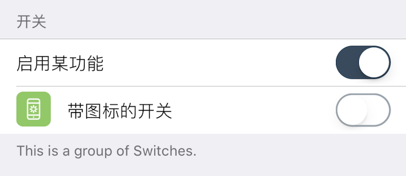

### Group 分组

此组件在界面上显示一个分组区域, 包含到下一个分组组件之间的所有组件. 通常用于功能划分, 也经常用于对某一组件的补充描述. 通常情况下, 列表中第一个组件必须是 `Group`, 如果不是, XUI 会自动在列表的第一个位置添加一个 `Group` 组件.

|键|类型|描述|必选|默认值|最低版本需求|
|---|---|---|---|---|---|
|label|字符串|分组标题|可本地化|`""`|\-|
|footerText|字符串|在当前组之后添加一行小字|可本地化|`""`|\-|

此组件不支持 `icon`/`height`.


#### 主题

|主题键|类型|描述|
|---|---|---|
|groupHeaderTextColor|*颜色*|分组首部标题颜色, 即 `label` 的颜色|
|groupFooterTextColor|*颜色*|分组尾部文字颜色, 即 `footerText` 的颜色|
|groupHeaderBackgroundColor|*颜色*|分组首部背景颜色|
|groupFooterBackgroundColor|*颜色*|分组尾部背景颜色|


#### 示例

``` lua
-- 分组组件
{
    cell = "Group";
    label = "开关";  -- 分组标题
    footerText = "这是一组开关";  -- 分组底部描述
};
-- 下面的两个组件是两个开关，会包含在该分组内
{
    default = true;
    label = "启用某功能";
    cell = "Switch";
    key = "enabled";  -- 该项存储的键，读取该键配置时需要用到
};
{
    default = false;
    label = "带图标的开关";
    cell = "Switch";
    key = "enabled1";  -- 该项存储的键，读取该键配置时需要用到
    icon = "res/16.png";  -- 其它有些组件也可以设置图标
    readonly = true; -- 所有组件都支持禁用
};
-- 另一分组
{
    cell = "Group";
    label = "另一组";
};
-- ...
```



