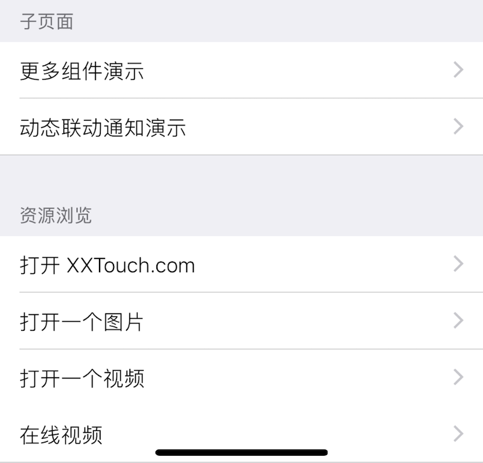

### Link 链接子界面

此组件在界面上显示一个子菜单项, 通常用于链接子界面. 

|键|类型|描述|必选|默认值|最低版本需求|
|---|---|---|---|---|---|
|url|字符串|子界面文件名|*|\-|\-|

`url` 可以为普通文件名、XUI 文件名或网络地址. 普通文件将使用默认打开方式打开, xui/xuic 文件将作为子界面打开, 网络地址将使用内置浏览器打开. 


#### 示例

``` lua
{
    cell = "Group";
    label = "子页面";
};
{
    url = "sub/xui-sub.xuic"; -- 相对于 xpp 的路径
    cell = "Link";
    label = "更多组件演示";
};
{
    url = "sub/xui-dynamic.xui";
    cell = "Link";
    label = "动态联动通知演示";
};
{
    cell = "Group";
    label = "资源浏览";
};
{
    url = "https://www.xxtouch.com";
    cell = "Link";
    label = "打开 XXTouch.com";
};
{
    url = "res/b6d21727a66f856f79dc9b6ef8e7b4d6.gif";
    cell = "Link";
    label = "打开一个图片";
};
{
    url = "res/SmartSelect.mp4";
    cell = "Link";
    label = "打开一个视频";
};
{
    url = "https://www.apple.com/apple-events/september-2015/";
    cell = "Link";
    label = "在线视频";
};
```



