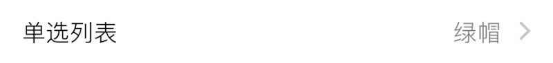
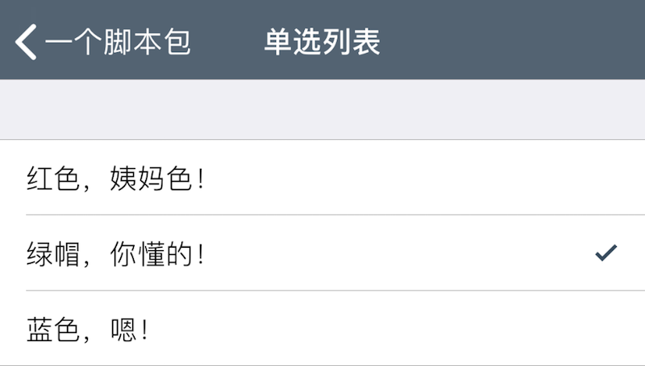

### Option 单项选择列表

此组件在界面上显示一个子菜单项, 用于链接包含一些选项的子菜单. 

|键|类型|描述|必选|默认值|最低版本需求|
|---|---|---|---|---|---|
|options|包含字典的数组|选项列表数组|*|\-|\-|
|footerText|字符串|显示在列表选项下方的小字|可本地化|`""`|\-|
|popoverMode|布尔型|采用悬浮样式|\-|`false`|1.2-4|

`options` 包含若干 *选项*, *选项* 为字典, 有如下属性: 

|键|类型|描述|条件|
|---|---|---|---|
|title|字符串|选项标题|可本地化|
|value|基本类型|选项配置值<br />若不填, 则与 `title` 一致.|可选|
|icon|字符串|选项图标文件名|可选|
|shortTitle|字符串|显示在父级菜单右侧的标题|可选, 可本地化|

|返回类型|描述|
|---|---|
|基本类型|选中项的 `value`|


#### 示例

``` lua
{
    default = "绿帽，你懂的！";  -- 默认值
    label = "单选列表";
    cell = "Option";
    key = "list-1";
    options = {
        {
            title = "红色，姨妈色！";
            shortTitle = "红色";  -- 显示在父级入口右侧
        };
        {
            title = "绿帽，你懂的！";
            shortTitle = "绿帽";
        };
        {
            title = "蓝色，嗯！";
            shortTitle = "蓝色";
        };
    };
    popoverMode = false;  -- 设为 true 可使用悬浮模式
    -- footerText = "只能选择一项"; -- 底部提示信息
};
```





