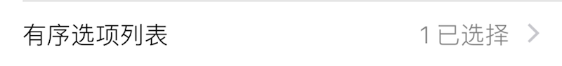
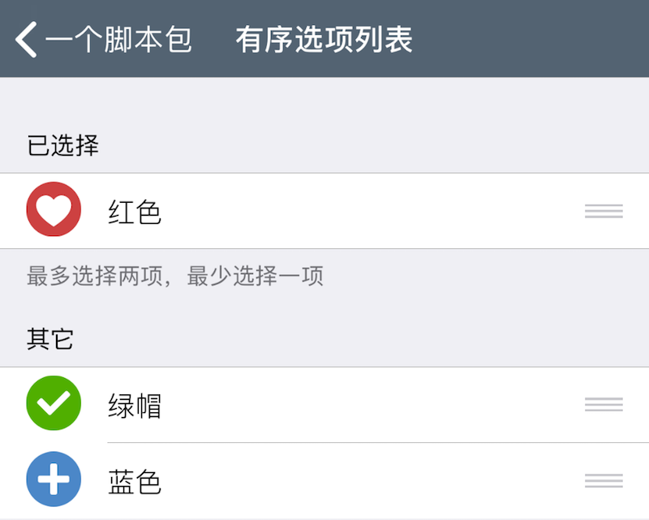
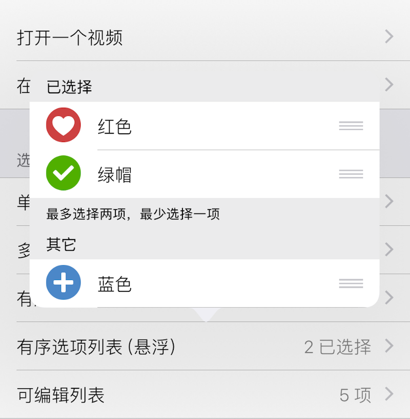

### OrderedOption 多项有序选择列表

此组件在界面上显示一个子菜单项, 用于链接包含一些选项的子菜单. 

|键|类型|描述|必选|默认值|最低版本需求|
|---|---|---|---|---|---|
|options|包含字典的数组|选项列表数组|*|\-|\-|
|footerText|字符串|显示在列表选项下方的小字|可本地化|`""`|\-|
|popoverMode|布尔型|采用悬浮样式|\-|`false`|1.2-4|
|minCount|整数|最少选择项目数|\-|`0`|\-|
|maxCount|整数|最多选择项目数|\-|`INT_MAX`|\-|

`options` 包含若干 *选项*, *选项* 为字典, 有如下属性: 

|键|类型|描述|条件|
|---|---|---|---|
|title|字符串|选项标题|可本地化|
|value|基本类型|选项配置值<br />若不填, 则与 `title` 一致.|可选|
|icon|字符串|选项图标文件名|可选|

|返回类型|描述|
|---|---|
|包含基本类型的数组|包含所有选中项 `value` 的数组|


#### 示例

``` lua
{
    default = {
        "红色";
    };
    label = "有序选项列表";
    cell = "OrderedOption";
    key = "list-3";
    maxCount = 2;  -- 最大选项数量
    minCount = 1;  -- 最小选项数量
    options = {
        {
            title = "红色";
            -- value = "Red";  -- 如果设置了 value，则配置项会保存 value
            icon = "res/red.png";
        };
        {
            title = "绿帽";
            -- value = "Green";
            icon = "res/green.png";
        };
        {
            title = "蓝色";
            -- value = "Blue";
            icon = "res/blue.png";
        };
    };
    popoverMode = false;  -- 设为 true 可使用悬浮模式
    footerText = "最多选择两项，最少选择一项";  -- 底部提示信息
};
```






