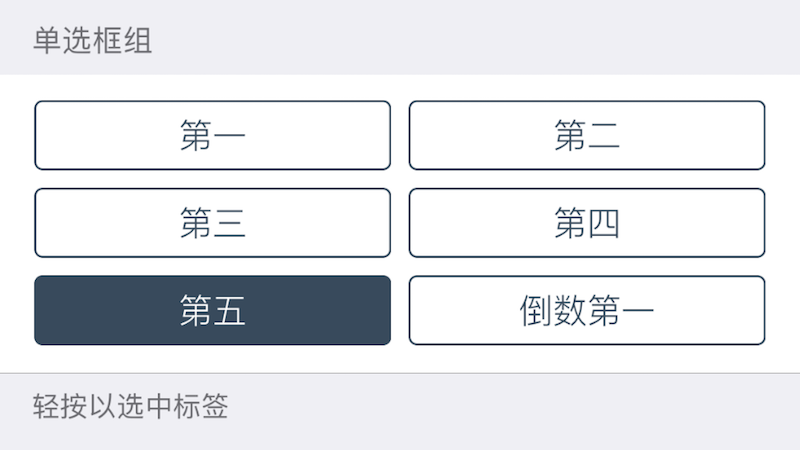
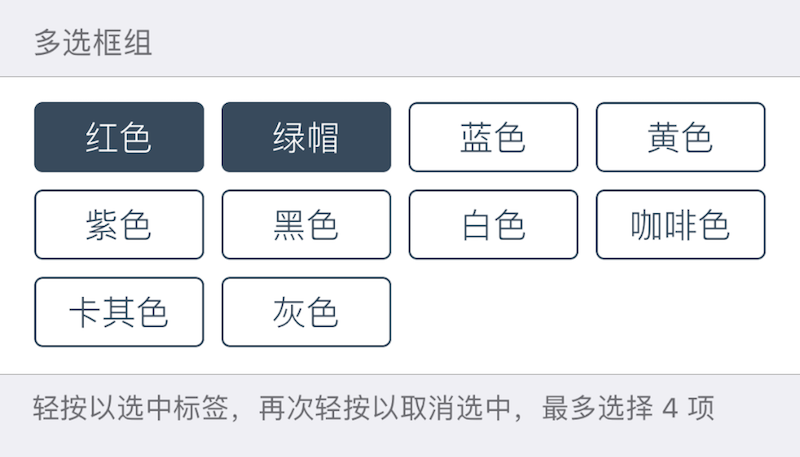

### Radio / Checkbox 单选框 / 复选框组

此组件在界面上显示若干单选框 / 复选框. 

点选**单选框**会选中当前选择的单选框, 取消同组其它单选框的选中状态. 
点选**复选框**会切换其选中 / 未选状态. 

|键|类型|描述|必选|默认值|最低版本需求|备注|
|---|---|---|---|---|---|---|
|options|包含字典的数组|选项列表数组|*|\-|\-|\-|
|numPerLine|整数|每行选项个数|\-|iPhone 为 `2`, iPad 为 `4`|1.2-10|最大值为 `12`|
|minCount|整数|最少选择项目数|\-|`0`|\-|`cell = 'Checkbox'`|
|maxCount|整数|最多选择项目数|\-|`INT_MAX`|\-|`cell = 'Checkbox'`|

`options` 包含若干 *选项*, *选项* 为字典, 有如下属性: 

|键|类型|描述|条件|
|---|---|---|---|
|title|字符串|选项标题|可本地化|
|value|基本类型|选项配置值<br />若不填, 则与 `title` 一致.|可选|

此组件不支持 `label`/`icon`/`height`, 如需要设置标题或备注, 请结合 `Group` 组件进行设计.

|返回类型|描述|
|---|---|
|包含基本类型的数组|包含所有选中项 `value` 的数组|


#### 主题

|主题键|类型|描述|
|---|---|---|
|tagTextColor|*颜色*|标签文字颜色|
|tagSelectedTextColor|*颜色*|选中标签文字颜色|
|tagBackgroundColor|*颜色*|标签背景颜色|
|tagSelectedBackgroundColor|*颜色*|选中标签背景颜色|
|tagBorderColor|*颜色*|标签边框颜色|
|tagSelectedBorderColor|*颜色*|选中标签边框颜色|


#### 示例

``` lua
{
    cell = "Group";
    label = "多选框组";
    footerText = "轻按以选中标签，再次轻按以取消选中，最多选择 4 项";
};
{
    default = {
        "红色";
        "绿帽";
    };
    cell = "Checkbox";
    key = "checkbox";
    maxCount = 4;
    numPerLine = 4;  -- 每行选项数量
    options = {
        {
            title = "红色";
        };
        {
            title = "绿帽";
        };
        {
            title = "蓝色";
        };
        {
            title = "黄色";
        };
        "紫色";
        "黑色";
        "白色";
        "咖啡色";
        "卡其色";
        "灰色";
    };
};
{
    cell = "Group";
    label = "单选框组";
    footerText = "轻按以选中标签";
};
{
    default = "Fifth";
    cell = "Radio";
    key = "radio";
    options = {
    {
        title = "第一";
    };
    {
        title = "第二";
    };
    {
        title = "第三";
    };
    {
        title = "第四";  -- 如果选项未设置 value，则该选项配置值为 title
    };
    {
        title = "第五";
        value = "Fifth";  -- 如果选项设置了 value，则该选项配置值为 value
    };
    "倒数第一";  -- 选项可以简写
    };
};
```





