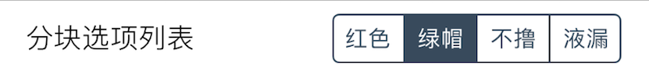

### Segment 适合少量选项的单项选择

此组件在界面上显示一个选项组. 用于选择单个选项 (总选项数一般少于 6 个). 

|键|类型|描述|必选|默认值|最低版本需求|
|---|---|---|---|---|---|
|options|包含字典的数组|选项列表数组|*|\-|\-|

`options` 包含若干 *选项*, *选项* 为字典, 有如下属性: 

|键|类型|描述|条件|
|---|---|---|---|
|title|字符串|选项标题|可本地化|
|value|基本类型|选项配置值<br />若不填, 则与 `title` 一致.|可选|

此组件不支持 `icon`.

|返回类型|描述|
|---|---|
|基本类型|选中项的 `value`|


#### 示例

``` lua
{
    default = "绿帽";
    label = "分块选项列表";
    cell = "Segment";
    key = "list-segment";
    options = {
        {
            title = "红色";
        };
        {
            title = "绿帽";
        };
        {
            title = "不撸";
        };
        {
            title = "液漏";
        };
    };
};
```



