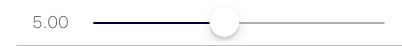

### Slider 数值拖拽滑块

此组件在界面上显示一个滑块, 用于浮点数值的选择和调整. 

|键|类型|描述|必选|默认值|最低版本需求|
|---|---|---|---|---|---|
|min|数值|滑块最小值|\-|`0.0`|\-|
|max|数值|滑块最大值|\-|`1.0`|\-|
|step|数值|调节歩长, 滑块会自动紧贴最近的步长值|\-|`0`|1.2-10|
|showValue|布尔型|是否显示当前滑块的值|\-|`false`|\-|

此组件不支持 `label`/`icon`, 如需要设置标题或备注, 请结合 `Group` 组件进行设计.

|返回类型|描述|
|---|---|
|数值|组件数值|


#### 主题

|主题键|类型|描述|
|---|---|---|
|tintColor|*颜色*|滑块进度底色|
|thumbColor|*颜色*|开关中心色|


#### 示例

``` lua
{
    showValue = true;  -- 是否显示当前值
    min = 1;  -- 最小值
    default = 5;  -- 默认值
    max = 10;  -- 最大值
    step = 0.5;  -- 可以设置步进间隔
    label = "滑动控件";
    cell = "Slider";
    key = "slider";
};
```



