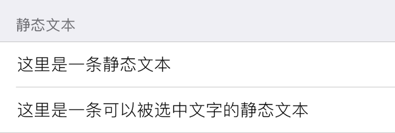

### StaticText 静态文本框

此组件在界面上显示一段静态文本, 即其 `label` 属性中的文本. 

|键|类型|描述|必选|默认值|最低版本需求|
|---|---|---|---|---|---|
|label|字符串|显示的文本|*|\-|\-|
|alignment|字符串|对齐方式|\-|`Left`|\-|
|selectable|布尔型|是否允许选择文本|\-|`false`|\-|

|alignment|描述|
|---|---|
|Left|左对齐|
|Center|居中|
|Right|右对齐|
|Natural|自然对齐|
|Justified|两边对齐|

此组件不支持 `icon`/`height`, 且暂不支持更改文本字体、尺寸等属性.


#### 示例

``` lua
{
    cell = "Group";
    label = "静态文本";
};
{
    cell = "StaticText";
    label = "这里是一条静态文本";
};
{
    cell = "StaticText";
    label = "这里是一条可以被选中文字的静态文本";
    selectable = true;  -- 允许选中
};
```



