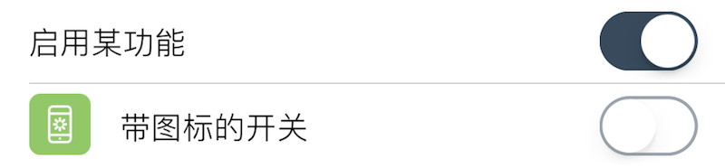

### Switch 开关

此组件在界面上显示一个开关. 

|键|类型|描述|必选|默认值|最低版本需求|
|---|---|---|---|---|---|
|negate|布尔型|反转开关显示情况|\-|`false`|\-|
|trueValue|基本类型|当结果为 `true` 时保存的值<br />若不填则保存 `true`|\-|`true`|\-|
|falseValue|基本类型|当结果为 `false` 时保存的值<br />若不填则保存 `false`|\-|`false`|\-|

|返回类型|描述|
|---|---|
|基本类型|与开关状态一致, 但若 `negate` 为真, 配置值为开关状态取反.<br />若存在, 配置值会被 `trueValue` 或 `falseValue` 代替.|


#### 主题

|主题键|类型|描述|
|---|---|---|
|offTintColor|*颜色*|关闭时开关底色|
|onTintColor|*颜色*|开启时开关底色|
|thumbTintColor|*颜色*|开关中心色|


#### 示例

``` lua
{
    default = true;
    label = "启用某功能";
    cell = "Switch";
    key = "enabled";  -- 该项存储的键，读取该键配置时需要用到
};
{
    default = false;
    label = "带图标的开关";
    cell = "Switch";
    key = "enabled1";  -- 该项存储的键，读取该键配置时需要用到
    icon = "res/16.png";  -- 其它有些组件也可以设置图标
    readonly = true;  -- 所有组件都支持禁用
};
```



