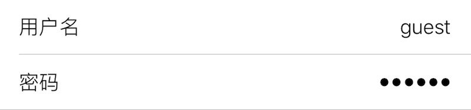
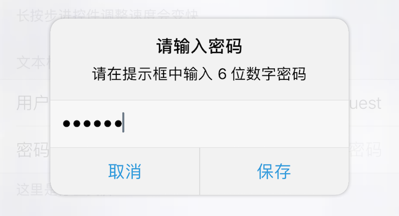

### TextField 单行文本框

此组件在界面上显示一个文本框, 用于字符串输入. 

|键|类型|描述|必选|默认值|最低版本需求|
|---|---|---|---|---|---|
|alignment|字符串|对齐方式|\-|`Left`|\-|
|keyboard|字符串|键盘类型|\-|`Default`|\-|
|placeholder|字符串|文本框占位符|可本地化|`""`|\-|
|isSecure|布尔型|字符是否显示为小圆点|\-|`false`|\-|
|clearButtonMode|字符串|是否显示清除小黑叉|\-|`Never`|\-|
|maxLength|整数|最大文本长度|\-|`INT_MAX`|\-|
|validationRegex|字符串|用于验证字符串条目的正则表达式|\-|`nil`|1.2-10|
|prompt|字符串|提示框标题|可本地化|`nil`|1.2-10|
|message|字符串|提示框信息|可本地化|`nil`|1.2-10|
|okTitle|字符串|提示框确定按钮标题|可本地化|`"好"`|1.2-10|
|cancelTitle|字符串|提示框取消按钮标题|可本地化|`"取消"`|1.2-10|

此组件不支持 `icon`. 若设置 `title` 属性, 建议将 `alignment` 属性设为 "Right".

修改或添加字符串条目时, 若字符串无法通过[正则表达式](http://tool.oschina.net/regex/) `validationRegex` 验证, 则无法保存当前条目.

`prompt` 或 `message` 不为空时, 轻按 `TextField`, 会弹出提示框, 并要求在提示框中输入值, 此特性需要 XXT v1.2-10 及更高版本与 iOS 8.0 及更高版本.

|alignment|描述|
|---|---|
|Left|左对齐|
|Center|居中|
|Right|右对齐|
|Natural|自然对齐|
|Justified|两边对齐|

|keyboard|描述|
|---|---|
|Default|标准及第三方键盘|
|Alphabet|标准 ASCII|
|ASCIICapable|标准 ASCII|
|NumbersAndPunctuation|数字与标点|
|URL|网址|
|NumberPad|数字|
|PhonePad|电话号码|
|NamePhonePad|姓名与电话号码|
|EmailAddress|电子邮箱|
|DecimalPad|带小数点的数字|

|clearButtonMode|描述|
|---|---|
|Never|从不显示|
|Always|一直显示|
|WhileEditing|仅编辑时显示|
|UnlessEditing|仅不编辑时显示|

|返回类型|描述|
|---|---|
|字符串|文本框内容|


#### 主题

|主题键|类型|描述|
|---|---|---|
|textColor|*颜色*|文字颜色|
|caretColor|*颜色*|光标颜色|
|placeholderColor|*颜色*|占位符颜色|


#### 示例

``` lua
{
    default = "";
    label = "用户名";
    cell = "TextField";
    key = "username";
    keyboard = "Default";  -- 默认键盘
    alignment = "Right";  -- 右对齐
    placeholder = "输入用户名";  -- 占位符
    maxLength = 21;  -- 最大长度
    validationRegex = "^[0-9a-zA-Z]+$";  -- 正则验证
};
{
    isSecure = true;  -- 显示为小圆点密码输入
    default = "";
    label = "密码";
    cell = "TextField";
    key = "password";
    keyboard = "NumberPad";  -- 数字小键盘
    alignment = "Right";  -- 右对齐
    placeholder = "输入密码";  -- 占位符
    prompt = "请输入密码";  -- 弹框标题
    message = "请在提示框中输入 6 位数字密码";  -- 弹框信息
    validationRegex = "^[0-9]{6}$";  -- 正则验证
    okTitle = "保存";  -- 提交按钮标题
    cancelTitle = "取消";  -- 取消按钮标题
};
```





