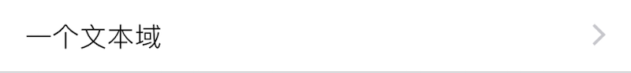
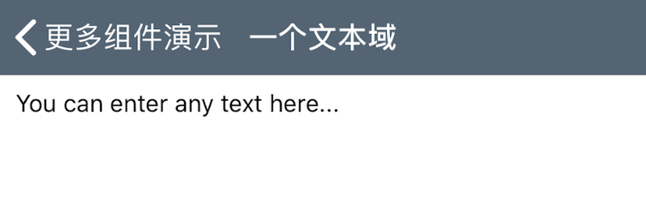

### Textarea 多行文本域

此组件在界面上显示一个子菜单项, 用于链接到一个多行文本输入界面. 

|键|类型|描述|必选|默认值|最低版本需求|
|---|---|---|---|---|---|
|maxLength|整数|最大文本长度|\-|`INT_MAX`|\-|
|keyboard|字符串|键盘类型|\-|`Default`|\-|
|autoCapitalization|字符串|自动大写模式|\-|`None`|\-|
|autoCorrection|字符串|自动更正模式|\-|`Default`|\-|

|keyboard|描述|
|---|---|
|Default|标准及第三方键盘|
|Alphabet|标准 ASCII|
|ASCIICapable|标准 ASCII|
|NumbersAndPunctuation|数字与标点|
|URL|网址|
|NumberPad|数字|
|PhonePad|电话号码|
|NamePhonePad|姓名与电话号码|
|EmailAddress|电子邮箱|
|DecimalPad|带小数点的数字|

|autoCapitalization|描述|
|---|---|
|None|无|
|Sentences|按句自动大写|
|Words|按单词自动大写|
|AllCharacters|全部大写|

|autoCorrection|描述|
|---|---|
|Default|默认|
|No|关闭自动更正|
|Yes|打开自动更正|

*暂不支持更改文本字体、尺寸等属性*

|返回类型|描述|
|---|---|
|字符串|文本内容|


#### 主题

|主题键|类型|描述|
|---|---|---|
|textColor|*颜色*|文字颜色|
|caretColor|*颜色*|光标颜色|
|placeholderColor|*颜色*|占位符颜色|


#### 示例

``` lua
{
    default = "You can enter any text here...";
    cell = "Textarea";
    key = "textarea";
    label = "一个文本域";
};
```





