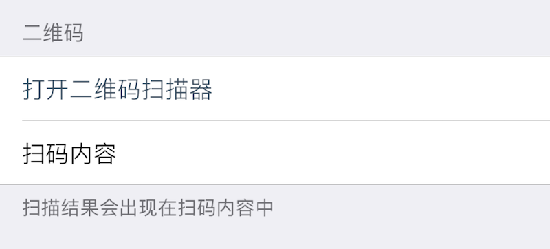
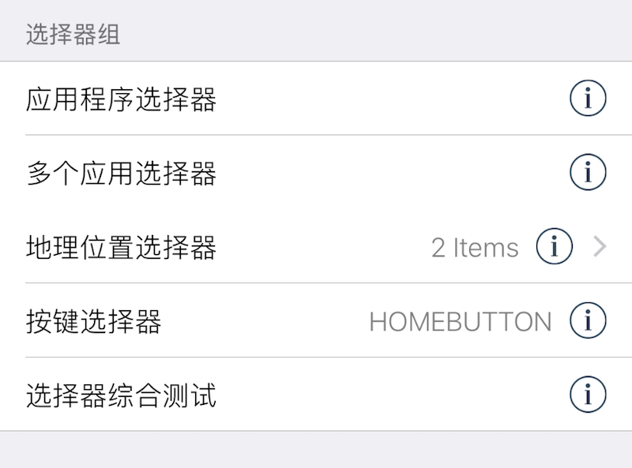

### TitleValue 键值对显示; 代码片段选择器

此组件在界面上显示 `key`, `value` 对, 类似 设置 -> 通用 -> 关于中系统参数键值对的显示. 

|键|类型|描述|必选|默认值|最低版本需求|
|---|---|---|---|---|---|
|value|基本类型|右侧显示值|\-|`nil`|\-|
|snippet|字符串|选择器脚本文件名|\-|`nil`|\-|

此组件可以左划将已存的配置值置空, 但不能覆盖 XUI 中提供的 `value`. 

如果为此组件设置了配置分区文件名 `defaults` 和配置键名 `key`, 则此组件可用来显示某一 XUI 配置项的实际值；若同时设置 `.snippet` 代码片段模板文件名, 则能够为此组件增加 XUI 内 **代码片段选择器** 的功能, 点击该组件能够唤起选择器队列, 队列处理完成后, 会将返回结果存入此组件的配置项内, 具体使用方法参见 [代码片段](/XUI/Snippet/START.html).


#### 示例

``` lua
{
    cell = "Group";
    label = "二维码";
    footerText = "扫描结果会出现在扫码内容中";
};
{
    cell = "Button";
    label = "打开二维码扫描器";
    key = "qr1";
    action = "ScanQRCode:";
    kwargs = {};
};
{
    cell = "TitleValue";
    label = "扫码内容";
    key = "qr1";
};
```





