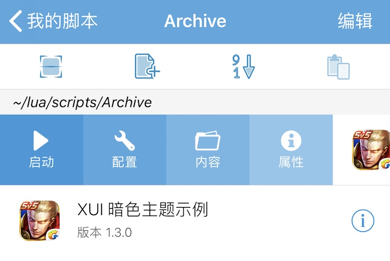

## 前言

在阅读本文前, 您需要对 Lua 语法有所了解, 并能理解 数值/布尔型/字符串/表 等基本数据类型.

 - 适用于 **v1\.2\-1** 及以上平台版本
 - 支持 iPhone/iPad 横竖屏, 支持 iOS 7 及以上系统版本
 - XUI 不与原有的对话框 \( dialog \) 和 WebView UI 冲突
 - XUI 为 [XPP 脚本包](/XPP/index.html) 提供界面扩展

XUI 用于在 XXTouch 上提供配置界面, 采用 iOS 系统原生组件, 本手册提供了 XUI 界面布局的规范. 我们提供了 XUI 完善的 [示例脚本包](/XUI/Demo.html), 这将有助于你理解本手册中各章节的内容.

XUI 是 [XPP 脚本包](/XPP/index.html) 的一部分, 用来为脚本包创建配置, 不能独立使用. 如需使用 XUI, 您需要 [创建](/XUI/Creation.html) 指定格式的 `.xui` 脚本, 放置在 XPP 脚本包中, 并在 `Info.lua` 脚本中设置 `MainInterfaceFile` 字段, 详情请参见 [XPP 脚本包](/XPP/index.html).

配置项可以通过 [XUI 脚本配置界面模块](/Handbook/xui/index.html) 进行读取、写入和更新. 

