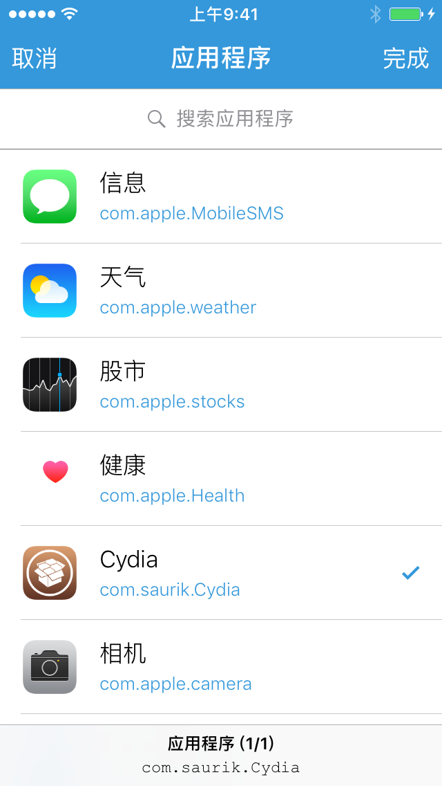
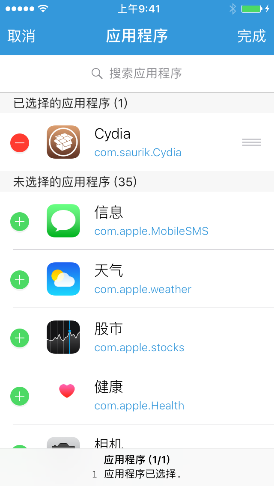

### 应用程序选择器

「应用程序选择器」提供了一个应用程序预览列表，提供了允许用户选择一个或多个应用程序的能力。

类型为 `app` 的「单个应用程序选择器」只允许用户勾选一个应用程序，其返回值为 **字符串**，是用户所选应用程序的 Bundle ID。

而类型为 `apps` 的「多个应用程序选择器」允许用户拖选多个应用程序并为其排序，其返回值为 **包含字符串的数组**，是用户所选应用程序 Bundle ID 的有序集合。


#### 示例

```lua
local group, name

group = 'App'
name = 'app.bundle_path(bid)'

return {
	name = string.format('%s - %s', group, name),
	description = "获取 App 的应用程序包路径",
	arguments = {
		{type = 'app'},
	},
	default = "com.darwindev.XXTExplorer",  -- 默认选中的应用 Bundle ID
	generator = function(bid)
		return string.format('app.bundle_path(%q)', bid)
	end,
}
```





