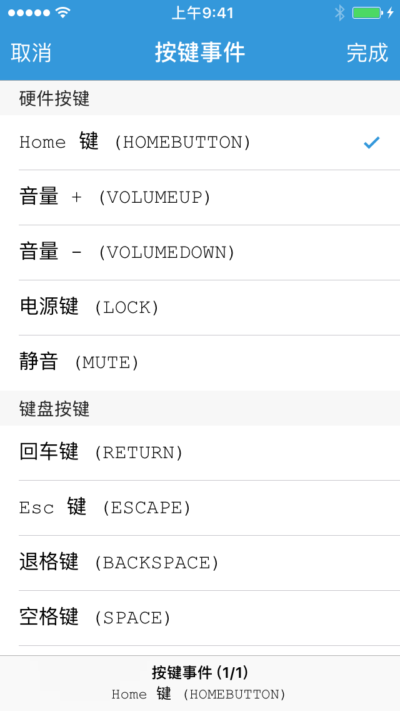

### 虚拟按键选择器

「虚拟按键选择器」提供了一个虚拟按键列表，如 HOME 键、音量 + 键、音量 - 键、电源键等等，并允许用户选择其中一种虚拟按键。

「虚拟按键选择器」类型为 `key`，其返回值为 **字符串**，是用户所选虚拟按键的键码，键码列表参见 [示例及支持的键码列表](/Handbook/key/samples.html)。


#### 示例

```lua
local group, name

group = '模拟'
name = 'key.press(key)'

return {
	name = string.format('%s - %s', group, name),
	description = "松开按下的物理按键",
	arguments = {
		{type = 'key'},
	},
	default = "HOME",  -- 默认选择的键码
	generator = function(key)
		return string.format('key.press(%q)', key)
	end,
}
```



