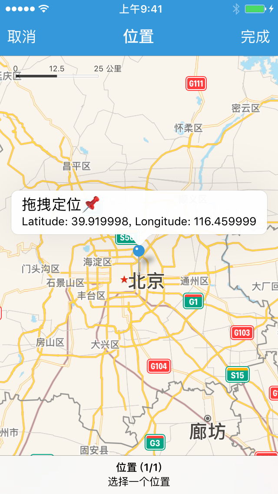

### 地理位置选择器

「地理位置选择器」提供了系统地图组件，允许用户使用大头钉定位一个地理位置。

「地理位置选择器」类型为 `loc`，其返回值为 **字典**，包含了所选地理位置的经纬度信息。

|键|类型|描述|
|---|---|---|
|latitude|数值|纬度|
|longitude|数值|经度|


#### 示例

```lua
local group, name

group = '辅助'
name = 'gps.fake(bid, latitude, longitude)'

return {
	name = string.format('%s - %s', group, name),
	description = "地理位置伪装",
	arguments = {
		{type = 'app', hint = '选择需要伪装的应用'},
		{type = 'loc', hint = '选择需要伪装的位置'},
	},
	default = {
		latitude = 39.92,
		longitude = 116.46
	},  -- 默认所在的位置
	generator = function(bid, loc)
		return string.format('gps.fake(%q, %f, %f)', bid, loc.latitude, loc.longitude)
	end,
}
```



