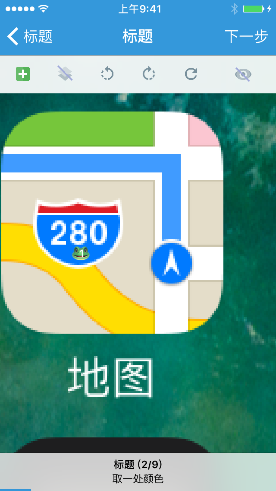
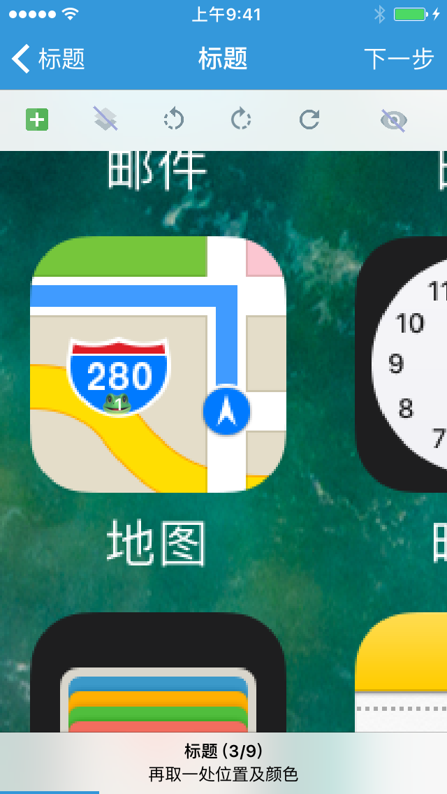
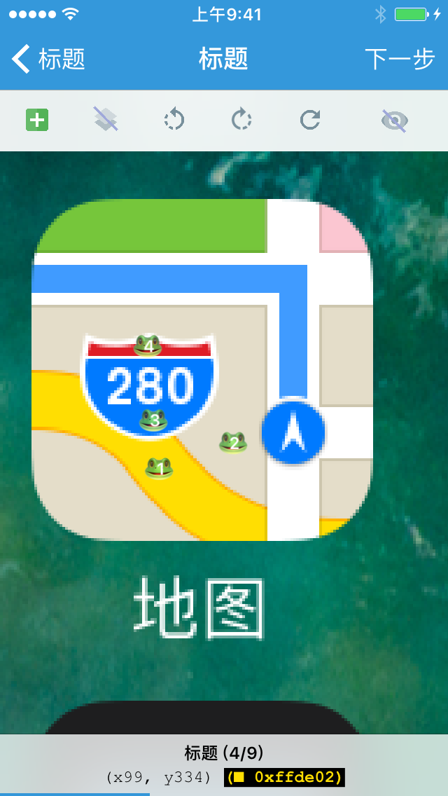

### 图像位置与颜色选择器

「图像位置与颜色选择器」提供了从系统相机胶卷与主目录选择截图，并在截图上标注一个或多个像素点，以获取其位置或颜色的能力。

类型为 `pos` 的「单个图像位置选择器」允许用户选择一个像素点，并获取它的位置，其返回值为 **包含两个数值的数组**，两个数值分别为像素点的 x 坐标和 y 坐标，如：

```lua
{ 512, 373 }
```

类型为 `color` 的「单个图像颜色选择器」允许用户选择一个像素点，并获取它的颜色，其返回值为像素点颜色 **RGB 的数值形式**，如：

```lua
0x3c1f8b
```

类型为 `poscolor` 的「单个图像位置与颜色选择器」允许用户选择一个像素点，并获取它的位置与颜色，其返回值为 **包含三个数值的数组**，三个数值分别为像素点的 x 坐标、像素点的 y 坐标、像素点颜色 RGB 的数值形式，如：

```lua
{ 512, 373, 0x3c1f8b }
```

类型为 `poscolors` 的「多个图像位置与颜色选择器」允许用户选择一个或多个像素点，并获取它们的位置与颜色，其返回值为 **二维数组**，包含了所有所选各像素点的 x 坐标、像素点的 y 坐标、像素点颜色 RGB 的数值形式，如：

```lua
{
    { 512, 373, 0x3c1f8b },
    { 512, 374, 0x3c1f7c },
    { 512, 375, 0x3c1f89 },
    -- ...
}
```


#### 示例

```lua
local group, name

group = '图色'
name = 'if (screen.is_colors(poscolors, 90)) then ... end'

return {
	name = string.format('%s - %s', group, name),
	description = "屏幕多点颜色匹配",
	arguments = {
		{type = 'poscolors'},
	},
	-- default = nil,  -- 该选择器暂不支持默认值
	generator = function(poscolors)
		local pcs = {}
		for i, pc in ipairs(poscolors) do
			pcs[#pcs + 1] = string.format('\t{ %4d, %4d, 0x%06x}, -- %3d\n', pc[1], pc[2], pc[3] & 0x00ffffff, i)
		end
		return string.format([[
if (screen.is_colors({
%s}, 90)) then
	@@
end]], table.concat(pcs))  -- 在返回的文本代码段中插入 @@，可以使编辑器光标自动移动到此处。
	end,
}
```







