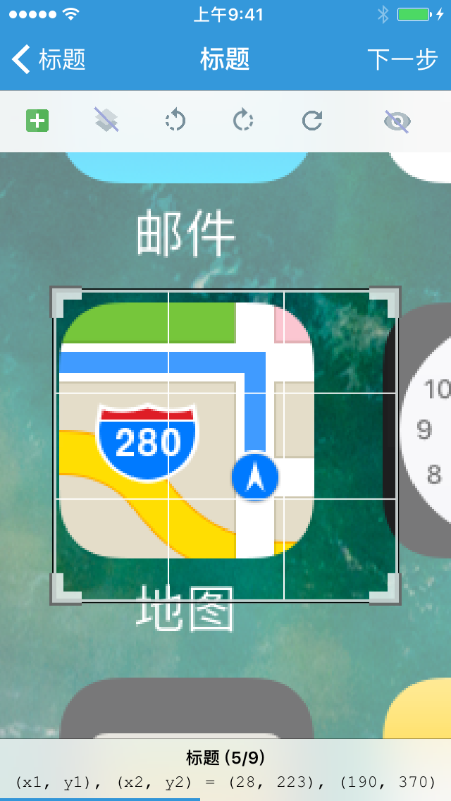

### 图像区域选择器

「图像区域选择器」提供了从系统相机胶卷与主目录选择截图，并在截图上标注一个矩形区域，以获取其顶点与尺寸的能力。

「图像区域选择器」类型为 `rect`，其返回值为 **包含四个数值的数组**，这四个数值分别为矩形区域左上角顶点的 x 坐标和 y 坐标、右下角顶点的 x 坐标和 y 坐标，如：

```lua
{ 0, 534, 295, 626 }
```


#### 示例

```lua
local group, name

group = '图色'
name = 'text = screen.ocr_text(rect)'

return {
	name = string.format('%s - %s', group, name),
	description = "屏幕区域文字识别",
	arguments = {
		{type = 'rect'},
	},
	generator = function(rect)
		return string.format('text = screen.ocr_text(%d, %d, %d, %d)', rect[1], rect[2], rect[3], rect[4])
	end,
}
```



